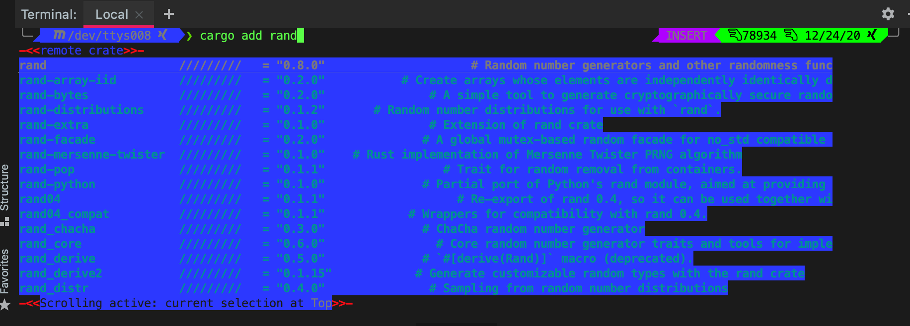

<p align="center">
  <a href="https://github.com/MenkeTechnologies/zsh-cargo-completion/actions/workflows/ci.yml"></a>
  
  
  
</p>

<h1 align="center">
  <code>>>> zsh-cargo-completion <<<</code>
</h1>

<p align="center">
  <b>// TURBOCHARGE YOUR CARGO WORKFLOW WITH TAB COMPLETIONS + ALIASES //</b>
</p>

---

<pre align="center">
 ╔══════════════════════════════════════════════════════════════╗
 ║  ALL OMZ CARGO COMPLETIONS + REMOTE CRATE SEARCH VIA TAB   ║
 ║  cargo add &lt;TAB&gt; / cargo install &lt;TAB&gt; = LIVE CRATE LOOKUP ║
 ╚══════════════════════════════════════════════════════════════╝
</pre>

---

### `> DEMO_`



> `cargo add` / `cargo install` + `<TAB>` queries **`cargo search`** and completes remote crate names in real time.

---

### `> ALIASES_`

```zsh
# ── CORE ──────────────────────────────────────────────
alias co=cargo                  # base command
alias cr='cargo run'            # run project
alias cb='cargo build --release'# release build

# ── CODE QUALITY ──────────────────────────────────────
alias ct='cargo test'           # run tests
alias ccy='cargo clippy'        # lint
alias cfm='cargo fmt'           # format
alias cfi='cargo fix'           # auto-fix
alias cfa='cargo fmt; cargo fix --allow-dirty --allow-staged'

# ── DEPENDENCIES ──────────────────────────────────────
alias cad='cargo add'           # add crate
alias ci='cargo install'        # install binary
alias ciu='cargo install-update -a' # update installed
alias cs='cargo search'         # search crates.io
alias cfe='cargo fetch'         # fetch dependencies

# ── PUBLISH ───────────────────────────────────────────
alias cpa='cargo package'       # package crate
alias cpl='cargo publish'       # publish to crates.io
alias ccl='cargo clean'         # clean target/
```

---

### `> INSTALL_`

<details>
<summary><b>// ZINIT (RECOMMENDED) //</b></summary>

> `~/.zshrc`
```zsh
source "$HOME/.zinit/bin/zinit.zsh"
zinit ice lucid nocompile
zinit load MenkeTechnologies/zsh-cargo-completion
```

</details>

<details>
<summary><b>// OH MY ZSH //</b></summary>

```sh
cd "$HOME/.oh-my-zsh/custom/plugins" && git clone https://github.com/MenkeTechnologies/zsh-cargo-completion.git
```

Add `zsh-cargo-completion` to the plugins array in `~/.zshrc`

</details>

<details>
<summary><b>// MANUAL //</b></summary>

```sh
git clone https://github.com/MenkeTechnologies/zsh-cargo-completion.git
```

Source `zsh-cargo-completion.plugin.zsh` from your `~/.zshrc` or any startup script.

</details>

---

<p align="center">
  <sub><code>MIT License</code> | <code>MenkeTechnologies</code></sub>
</p>
